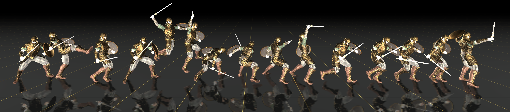

# C·ASE: Learning Conditional Adversarial Skill Embeddings for Physics-based Characters

[](https://arxiv.org/abs/2309.11351)
[](LICENSE)

Official implementation of the SIGGRAPH Asia 2023 paper:

**"C·ASE: Learning Conditional Adversarial Skill Embeddings for Physics-based Characters"**

[Zhiyang Dou](https://frank-zy-dou.github.io/), [Xuelin Chen](https://xuelin-chen.github.io/), [Qingnan Fan](https://fqnchina.github.io/), [Taku Komura](https://i.cs.hku.hk/~taku/), [Wenping Wang](https://engineering.tamu.edu/cse/profiles/Wang-Wenping.html)



## Abstract

We present C·ASE, an efficient and effective framework that learns Conditional Adversarial Skill Embeddings for physics-based characters. Our physically simulated character acquires a diverse repertoire of skills while maintaining direct control over which skill to perform. C·ASE partitions heterogeneous motion data into distinct subsets of homogeneous samples, enabling a low-level conditional model to learn skill-specific behavior distributions. This skill-conditioned imitation learning provides explicit control over the character's skills after training. Our training pipeline incorporates Focal Skill Sampling, Skeletal Residual Forces, and Element-wise Feature Masking to balance skills of varying complexity, compensate for dynamics mismatch when mastering agile motions, and capture more generalizable behavior characteristics, respectively.

## Key Features

- **Conditional Skill Control**: Directly specify which skill the character should perform via skill labels
- **Focal Skill Sampling (FSS)**: Dynamically reweights training samples to balance skills of varying complexity
- **Element-wise Feature Masking (EFM)**: Dropout-based regularization that improves generalization across skills
- **Skeletal Residual Forces (SRF)**: Compensates for dynamics mismatch between simulation and recorded motion data
- **Hierarchical Control (HRL)**: High-level policy outputs hybrid discrete-continuous actions (skill label + style latent)

## Installation

### Prerequisites

- Ubuntu 18.04 or later
- NVIDIA GPU with CUDA support
- [Isaac Gym Preview 4](https://developer.nvidia.com/isaac-gym)

### Setup

1. **Download Isaac Gym** from the [NVIDIA website](https://developer.nvidia.com/isaac-gym) and follow the installation instructions.

2. **Create a conda environment and install dependencies:**

```bash
conda create -n case python=3.8
conda activate case
pip install -r requirements.txt

# Install Isaac Gym
cd /path/to/IsaacGym_Preview_4_Package/isaacgym/python
pip install -e .

# Install the modified rl-games (required for EFM/dropout support)
cd /path/to/this/repo
cd rl-games-1.1.4
pip install -e .
cd ..
```

## Quick Start

### Training the Low-Level Controller (LLC)

Train the C·ASE low-level controller on the sword & shield dataset:

**Option 1: 87 skills (one-to-one mapping)**
```bash
bash train_87.sh
```

**Option 2: 14 skills (semantic grouping)**
```bash
bash train_14.sh
```

The 14-skill variant groups similar motions into semantic categories (e.g., combo attacks, dodges, parries), demonstrating many-to-one motion-to-skill mapping. These groupings can be created manually, via motion segmentation networks, or using LLMs if you have descriptive motion file names.

### Training the High-Level Controller (HRL)

After training the LLC, you can train a high-level controller for goal-directed tasks:

```bash
bash train_hrl_87.sh
```

The HRL outputs a hybrid action space:
- **Skill logits** (discrete): Probability distribution over skill labels, converted via Gumbel-Softmax
- **Style latent** (continuous): Latent code normalized to the unit sphere

Available high-level tasks: `HumanoidHeading`, `HumanoidLocation`, `HumanoidReach`, `HumanoidStrike`

### Testing

Test trained models:

```bash
bash test_87.sh      # Test 87-skill LLC
bash test_14.sh      # Test 14-skill LLC
bash test_hrl_87.sh  # Test HRL with heading task
```

## Training Details

### Custom Training Command

```bash
python case/run.py --task HumanoidAMPGetup \
    --cfg_env case/data/cfg/humanoid_ase_sword_shield_getup.yaml \
    --cfg_train case/data/cfg/train/rlg/ase_humanoid.yaml \
    --motion_file case/data/motions/reallusion_sword_shield/dataset_reallusion_sword_shield_avg.yaml \
    --clip2group_mapping case/data/motions/reallusion_sword_shield/motion_to_group_mapping.yaml \
    --labellength 1 --num_envs 2048 --numAMPObsSteps 20 \
    --nlabels 87 --skill_latent_size 64 --style_latent_size 32 \
    --if_focal --start_focal_epoch 500 \
    --dropout_rate 0.1 --if_dropout \
    --headless --alpha 0.2 --save_frequency 50
```

### Key Arguments

| Argument | Description |
|----------|-------------|
| `--motion_file` | Dataset YAML file listing motion clips |
| `--clip2group_mapping` | YAML file mapping motions to skill labels |
| `--nlabels` | Number of skill labels (must match the mapping file) |
| `--skill_latent_size` | Dimension of the skill embedding |
| `--style_latent_size` | Dimension of the ASE-style latent vector (z) |
| `--if_focal` | Enable Focal Skill Sampling |
| `--start_focal_epoch` | Epoch at which to activate FSS |
| `--if_dropout` | Enable Element-wise Feature Masking |
| `--dropout_rate` | Dropout rate for EFM |
| `--enable_srf` | Enable Skeletal Residual Forces (see note below) |
| `--srf_scale` | Scale factor for residual forces (default: 50.0) |
| `--srf_reward_weight` | Regularization weight to minimize SRF usage (default: 0.1) |
| `--headless` | Run without visualization |

### Skeletal Residual Forces (SRF)

SRF compensates for dynamics mismatch between simulation and recorded motion data by adding learnable residual forces to specified body joints. However, **SRF may affect physical realism** as it allows the character to apply forces that don't correspond to actual muscle actuation.

**Recommendation**: For the sword & shield motion dataset, SRF is **not required** and is disabled by default. The motions can be learned well without SRF.

To enable SRF (e.g., for more agile/acrobatic motions):
```bash
# LLC training with SRF
--enable_srf --srf_scale 30.0 --srf_reward_weight 0.1

# HRL training/testing with SRF-enabled LLC
--llc_enable_srf --llc_srf_scale 30.0
```

## Data Format

### Motion Files

Motion clips are stored as `.npy` files in `case/data/motions/`. Datasets are defined via YAML files:

```yaml
motions:
  - file: "motion_clip_1.npy"
    weight: 1.0
  - file: "motion_clip_2.npy"
    weight: 1.0
```

### Motion-to-Skill Mapping

C·ASE requires a mapping file that assigns motion clips to skill groups.

**One-to-one mapping** (each motion corresponds to one skill):
```yaml
groups:
  skill_00:
    motions:
      - attack_01.npy
  skill_01:
    motions:
      - attack_02.npy
```

**Many-to-one mapping** (semantically similar motions share a skill label):
```yaml
groups:
  combo_attack:
    motions:
      - attack_2xcombo_01.npy
      - attack_2xcombo_02.npy
      - attack_3xcombo_01.npy
  dodge:
    motions:
      - dodge_left.npy
      - dodge_right.npy
```

See `motion_to_group_mapping.yaml` (87 skills) and `motion_to_group_mapping_14skills.yaml` (14 semantic groups) for complete examples.

### Visualizing Motion Clips

```bash
python case/run.py --test --task HumanoidViewMotion --num_envs 2 \
    --cfg_env case/data/cfg/humanoid_sword_shield.yaml \
    --cfg_train case/data/cfg/train/rlg/amp_humanoid.yaml \
    --motion_file case/data/motions/reallusion_sword_shield/RL_Avatar_Atk_2xCombo01_Motion.npy
```

## Project Structure

```
CASE/
├── case/
│   ├── data/
│   │   ├── cfg/                    # Configuration files
│   │   └── motions/                # Motion data
│   ├── env/tasks/                  # Environment definitions
│   ├── learning/                   # Training algorithms
│   │   ├── ase_agent.py            # C·ASE low-level agent
│   │   ├── ase_network_builder.py  # Network architecture
│   │   ├── case_hrl_agent.py       # C·ASE high-level agent
│   │   ├── case_hrl_players.py     # HRL inference player
│   │   └── amp_agent.py            # AMP base agent
│   ├── poselib/                    # Motion processing utilities
│   └── run.py                      # Main entry point
├── rl-games-1.1.4/                 # Modified rl-games library
├── train_87.sh                     # Train LLC (87 skills)
├── train_14.sh                     # Train LLC (14 skills)
├── train_hrl_87.sh                 # Train HRL
├── test_87.sh                      # Test LLC (87 skills)
├── test_14.sh                      # Test LLC (14 skills)
├── test_hrl_87.sh                  # Test HRL
└── README.md
```

## Troubleshooting

### rl-games Version Error

If you encounter:
```
TypeError: _build_mlp() got an unexpected keyword argument 'if_dropout'
```

Install the modified rl-games library:
```bash
cd rl-games-1.1.4 && pip install -e . && cd ..
```

### Isaac Gym / Vulkan Issues

Set the following environment variables:
```bash
export LD_LIBRARY_PATH=$LD_LIBRARY_PATH:$CONDA_PREFIX/lib
export LD_LIBRARY_PATH=$LD_LIBRARY_PATH:/path/to/isaacgym/python/isaacgym/_bindings/linux-x86_64/
export VK_ICD_FILENAMES="/usr/share/vulkan/icd.d/nvidia_icd.json"
```

## Citation

If you find this work useful in your research, please cite:

```bibtex
@inproceedings{dou2023case,
  title={C·ASE: Learning Conditional Adversarial Skill Embeddings for Physics-based Characters},
  author={Dou, Zhiyang and Chen, Xuelin and Fan, Qingnan and Komura, Taku and Wang, Wenping},
  booktitle={SIGGRAPH Asia 2023 Conference Papers},
  pages={1--11},
  year={2023}
}
```

## License

This project is licensed under the NVIDIA License. See the [LICENSE](LICENSE) file for details.

**Note**: This license permits non-commercial use for research and evaluation purposes only.

## Acknowledgements

This codebase builds upon:
- [ASE](https://github.com/nv-tlabs/ASE) by NVIDIA
- [Isaac Gym](https://developer.nvidia.com/isaac-gym) by NVIDIA
- [rl-games](https://github.com/Denys88/rl_games)
# CASE_test
# CASE_test
